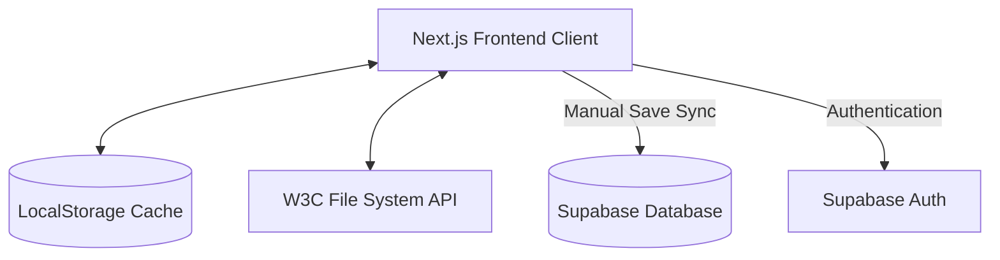

# Cortex: System Design & Architecture

Cortex is a privacy-first, local-first digital workspace designed for developers, researchers, and power users who demand control over their digital thoughts. It balances offline-first workspace logic with secure manual cloud synchronization and dual-vault plausible deniability.

---

## 1. System Architecture Overview

Cortex uses a hybrid client-cloud topology where all core operations (editing, cryptography, layout rendering) execute strictly inside the client sandbox, using Supabase as a zero-knowledge cloud backing.



### 1.1 Technology Stack
*   **Framework:** Next.js (App Router)
*   **Styling:** Tailwind CSS (v4) with custom amber/neon-cyber theme tokens.
*   **Rich Text Engine:** Tiptap (Prosemirror-based) custom extensions for daily logs, inline markdown, code highlighting, and finance tables.
*   **Vector Engine:** SVG-based Whiteboard canvas with custom stroke path rendering.
*   **Database & Auth:** Supabase (PostgreSQL with RLS, GoTrue Auth).

---

## 2. Core Functional Components

### 2.1 Workspace & File Manager
The workspace operates on an active file layout. Files are categorized into four semantic types:
*   `text` (.txt, .md): Multi-page markdown-compatible notes.
*   `code` (.js, .py, .cpp, etc.): Monospace editor with Monaco or CodeMirror highlighting.
*   `finance` (.csv): Spreadsheet grid bound directly to table components.
*   `whiteboard` (.board, .canvas): Interactive drawing canvas.

### 2.2 The Pages Mapping (`pagesMap`)
Cortex supports multi-page files. To maintain performance, the page contents are stored in a key-value mapping (`pagesMap`) rather than nested in the file metadata:
```typescript
interface Page {
  id: number;
  content: string;
  bgType?: 'dotted' | 'lined' | 'plain' | 'white';
}
type PagesMap = Record<string, Page[]>; // File ID -> Array of Pages
```

---

## 3. Cryptographic Plausible Deniability Vault

To protect master credentials, Cortex implements a military-grade dual-vault decoy encryption system.

```mermaid
flowchart TD
    Pass[User Password Input] --> PBKDF2[PBKDF2 Derivation]
    PBKDF2 --> Key[256-bit AES-GCM Key]
    Key --> Decrypt{Attempt Decryption}
    Decrypt -->|Matches Real Password| Real[Load Real Vault]
    Decrypt -->|Matches Burner Password| Decoy[Load Decoy Vault]
    Decoy --> Wipe[RAM Scrubbing: Overwrite Real Ciphertext with .fill(0)]
```

### 3.1 Key Cryptographic Controls:
1.  **Dual-Vault Decoy:** The encrypted payload stores two ciphertexts. Inputting a decoy "burner" password successfully decrypts a decoy workspace, while the real password loads the actual workspace.
2.  **RAM Isolation:** If the decoy password is entered, the app immediately overwrites the memory address of the real ciphertext using `.fill(0)` in JS Uint8Arrays before garbage collection.
3.  **Clipboard Decay:** Copying vault passwords clears the system clipboard automatically after 15 seconds to prevent background spyware harvesting.
4.  **Auto-Lock triggers:** The vault immediately locks and wipes its state on:
    *   5 minutes of idle keyboard/mouse inactivity.
    *   Browser tab visibility changes (`visibilitychange` - e.g., when switching tabs or minimization).
    *   Window `beforeunload` events.

---

## 4. Supabase Synchronization Pipeline

Synchronization uses a manual sync model to avoid performance degradation and database traffic spikes.

### 4.1 Database Schema (`public.files` Table)
```sql
CREATE TABLE public.files (
  id TEXT PRIMARY KEY, -- Accepts frontend IDs (e.g. "3", "t_text_123")
  name TEXT NOT NULL,
  content TEXT DEFAULT '', -- Stores raw text, CSV data, or serialized JSON pages
  type TEXT DEFAULT 'text',
  user_id UUID REFERENCES auth.users(id) ON DELETE CASCADE,
  updated_at TIMESTAMP WITH TIME ZONE DEFAULT now() NOT NULL
);
```

### 4.2 Page Serialization
To sync multi-page documents (notes and whiteboards) to a single-column database table:
*   **Save:** If `pagesMap[file.id]` contains page content, the array is stringified to a JSON array and saved in the `content` column.
*   **Load:** Upon user sign-in, the sync engine fetches files. If a file's `content` starts with `[`, it parses the string back into page objects, populates the client-side `pagesMap`, and writes it to the local cache.

---

## 5. Local Data Sovereignty & Portability

To prevent vendor lock-in, Cortex supports native local directories and standardized exports:
*   **Obsidian Markdown Compiler:** Compiles tables, lists, and drawings into Obsidian-compatible markdown files, injecting YAML metadata blocks and semantic Wikilinks.
*   **W3C File System Access API:** Direct mounting of a physical folder on the user's hard drive. Changes save locally in real-time without cloud databases or sandbox restrictions.
