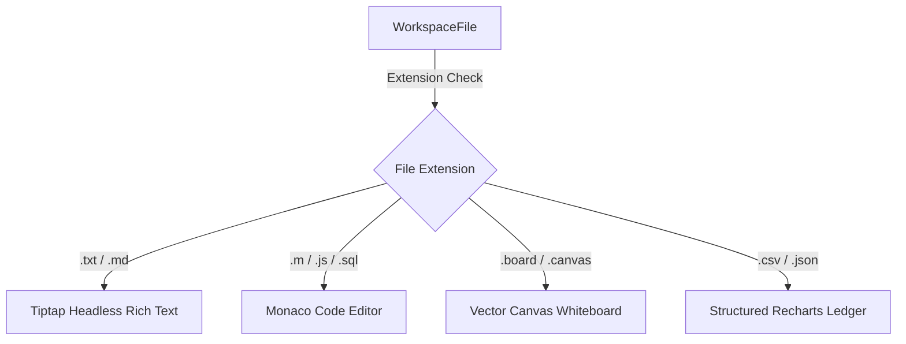
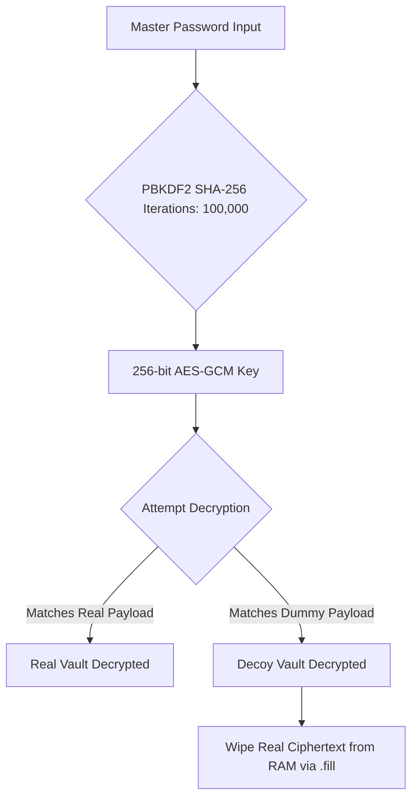

# Project Report: Cortex Workspace Architecture

## Executive Summary
**Cortex** is a state-of-the-art, multi-modal cognitive workspace designed to bridge the gap between structured databases, text records, code files, and freeform vector whiteboards. Designed for privacy-conscious developers, security researchers, and productivity min-maxers ("the nerds"), Cortex runs **100% locally and client-side** in the browser, while providing hooks for cloud persistence (Supabase) and ultra-fast edge inference (Groq/Llama 3.3 70B).

The system features a **Cyberpunk Neon / Glassmorphic** theme, dynamic semantic linking using client-side similarity calculations, zero-knowledge cryptographic credential storage with plausible deniability decoys, and a W3C File System Access API pipeline for real-time hard-drive syncing.

---

## 1. Core Visuals & System Theming

The user interface uses a premium dark aesthetic designed to evoke a modern high-fidelity cybernetic terminal:
*   **Color Tokens**:
    *   **Background (`bg`)**: `#07070a` (Deep cosmic black)
    *   **Surface (`surface`)**: `#111118` / **Elevated (`elevated`)**: `#17171f`
    *   **Sidebar (`sidebar`)**: `#0b0b0f`
    *   **Glows/Accents**: Amber (`#f09532`), Blue (`#6199f5`), Purple (`#9b7ff0`), Green (`#4dba84`), Red (`#e07272`).
*   **CSS Animations**:
    *   `pulse-ring`: Smooth radial expansion for active files and temporal triggers.
    *   `dash`: Flowing vector lines along semantic graph links to represent active context paths.
    *   `glow-pulse`: Cyberspace indicator lights representing AI background indexing.

---

## 2. Multi-Modal Canvas Architecture

The central editing pane is a polymorph canvas switcher (`DynamicCanvas.tsx`) that changes rendering views dynamically based on the file extension:



### 2.1 Rich Text Modality (Tiptap Headless)
*   **Headless Styling**: Bypasses traditional text areas by mounting Tiptap's rich-text core inside a custom CSS layer with custom font rendering (Inter & Outfit).
*   **Custom FontSize extension**: Evaluates CSS textStyles on-the-fly, mapping font attributes directly to HTML elements.
*   **Page-Strip Segmentation**: Allows long notes to be broken into multiple virtual page strips (linked via `PageStrip` controls), which are joined by horizontal rules (`---`) on hard-drive export.

### 2.2 Vector Canvas Whiteboard (`WhiteboardEditor.tsx`)
*   **Double Canvas Render Loop**: 
    1.  **Main Canvas**: Renders persistent drawings, pens, and lines in coordinate space.
    2.  **Laser Canvas**: Renders a trailing, self-fading presenter laser pointer. Points are filtered out if their timestamp is older than 500ms. Renders glowing neon lines using 2D canvas shadow blurs (`shadowBlur = 10`, `shadowColor = rgba(240, 50, 50, 1)`).
*   **Paper Grid Templates**: Instantly switches backing styles:
    *   `dotted`: Radial circle vector gradients (`background-size: 24px 24px`).
    *   `lined`: Horizontal linear repeating bands.
    *   `plain`: Clear space.
    *   `white`: Full high-contrast print white.
*   **Interactive Draggable Overlays**: Draggable HTML widgets mounted inside the canvas coordinate grid using HTML5 Pointer Capture APIs:
    *   *Image Pinner*: Inserts image uploads, resizable from all directions via coordinate multipliers. Uses aspect ratio-locking resize handles.
    *   *Interactive Tables*: Renders editable grid matrices with cell-level inputs and color picker border modifications.
    *   *Dynamic Checklists*: Floating todo panels with striking line-through completion animations.

### 2.3 Code Modality (Monaco Engine Integration)
*   **MATLAB Syntax Tokenizer**: Renders native `.m` script structures with custom syntax highlighting, lexical analysis, and code folding.
*   **Cyberpunk Neon Theme**: Maps keywords to glowing purples, variable values to amber, and strings to matrix greens.
*   **Line-Number Sync**: Custom 1-indexed side gutters matching theme colors.

### 2.4 Structured Data Ledger (Recharts & CSV Grid)
*   Renders `.csv` and `.json` tabular files into clean, editable grid tables.
*   **Live Charts**: Direct bindings to a Recharts `PieChart` showing real-time budget or metric splits. Any change in the grid cells immediately recalculates the chart.

---

## 3. Intelligent AI & Speech Routing Pipelines

Cortex utilizes an AI Data Bridge running on Groq Llama 3.3 70B (under 30-second timeouts) to convert raw input into structured actions.

### 3.1 NEO: Socratic Brainstorming Sidebar
*   **Socratic Prompting**: NEO acts as an intellectual sparring partner. Instead of simply generating code or text (which decreases cognitive retention), it is strictly prompted to ask deep, probing, architectural questions and challenge the developer's assumptions.
*   **Stream Append Protocol**: Employs direct fetch buffers to bypass standard Next.js AI SDK React hook lag, ensuring smooth character-by-character updates.
*   **Context Payload**: Bundles the active document, truncated related notes, and scheduled reminder times inside the API payload.

### 3.2 Dynamic Tiptap Nodes (Inline AI Commands)

Cortex injects intelligent nodes directly inside document paragraphs via Tiptap keyboard shortcuts and input rules:

| Command Trigger | Macro Syntax | Under-the-Hood Process | Visual Feedback |
| :--- | :--- | :--- | :--- |
| **Data Bridge Spark** | `/log <text>` or `$$<text>$$` | Queries `/api/bridge` to check if text contains expense logs. If yes, parses amount/category, fires a `cortex-bridge` custom event, and updates the target CSV ledger. | Blinking grey dot (pending) $\rightarrow$ Glowing amber dot. Tooltip reveals amount, category, and target file. |
| **Temporal Reminder** | `/remind <text>` or `@remind(<text>)` | Queries `/api/voice-intent`. Translates relative date strings (e.g. "tomorrow morning") into strict ISO timestamps using client clock. Fires a `cortex-reminder-created` event to register an alarm. | Blinking neon-blue pill with shadow glow (active) $\rightarrow$ Triggered warning. Expired alarms show a line-through styling. |
| **Vault Credentials** | `/password <title> <pwd>` | Extracts credential information, dispatches `cortex-vault-add` to encrypt the secret, and scrubs raw text from the editor. | Replaced with an inline lock badge: `🔒 Secured: <title>`. |

### 3.3 Reminder Alarm Loop & Teleportation
*   **Web Audio Synth**: A local scheduler inspects alarms every 2 seconds. When an alarm triggers, it generates a custom cybernetic alert chime using Web Audio oscillators (Sine 880Hz ramping to 1760Hz, mixed with a Triangle 440Hz wave), avoiding audio file assets.
*   **Instant Teleportation**: Clicking the alarm notification updates the application viewport, loads the originating document, scrolls the text editor directly to the specific Tiptap node position, and triggers a bright cyan neon pulse border around the node.

---

## 4. Cryptographic Vault (Zero-Knowledge Decoy Design)

Cortex features an offline-first, high-grade security vault for storing sensitive keys and logins (`VaultContext.tsx` & `cryptoUtils.ts`):



### 4.1 Plausible Deniability Dual-Vault Decoy
*   **Decoy Mechanism**: The vault stores two ciphertext payloads: `realPayload` (real keys) and `dummyPayload` (decoy burner keys).
*   **Decryption Routing**: The derived AES-GCM key attempts decryption on both. 
    *   Entering `real_password` decrypts the real vault.
    *   Entering the decoy `burner_password` decrypts the decoy vault.
*   **RAM Scrubbing (`wipeFromMemory`)**: If the decoy password is used, the system invokes a manual scrubbing loop on the raw Uint8Array containing the real ciphertext, calling `.fill(0)` to overwrite memory addresses prior to garbage collection.

### 4.2 Clipboard Decay (Anti-Snooping)
*   Copying passwords from vault cards copies them to the system clipboard and triggers a 15-second countdown.
*   Upon hitting zero, it executes `navigator.clipboard.writeText('')` to purge the secret, preventing background clipboard sniffer malware from harvesting keys.

### 4.3 Multi-Event Auto-Lock
*   **Idle Timeout**: Automatically locks the vault and purges RAM states after 5 minutes of keyboard/mouse inactivity.
*   **Visibility Lock**: Instantly locks the vault if the browser tab loses focus (`visibilitychange`), protecting data from physical screenshare eavesdropping.
*   **BeforeUnload Lock**: Locks and destroys memory variables right before a page refresh.

---

## 5. Local Data Sovereignty & Portability Hub

To ensure users are never locked into the platform, Cortex implements a local transform and synchronization pipeline (`exporter.ts`):

### 5.1 Obsidian-Native Markdown Compilation
*   **HTML-to-MD Parser**: Recurses through Tiptap's DOM nodes, parsing tables into markdown pipe notation (`|`), headings to hashes, lists to asterisks, and code nodes to markdown block ticks.
*   **Obsidian Front-Matter Injection**: Prefixes files with YAML metadata block:
    ```yaml
    ---
    id: "active-file-id"
    name: "Ideas.txt"
    tags: [cortex-export, autonomy-sync]
    related_nodes: ["[[Ideas]]", "[[Q2_Finance]]"]
    exported_at: "2026-06-04T03:31:18.000Z"
    ---
    ```
*   **Wikilinks Footer**: Computes real-time semantic Jaccard similarity. Appends a relationship footer using Obsidian's double-bracket syntax (`[[Note Title]]`), allowing Obsidian's local node graph to populate instantly upon folder drag-and-drop.

### 5.2 Drawing SVG Snapshot compilation
*   Finds drawing boundaries (bounding boxes with 40px offsets).
*   Generates a clean vector path layout with rounded cap join coordinates, exporting whiteboards as visual `.svg` vectors as well as raw coordinate `.json` backup files.

### 5.3 Client-side zip compilation
*   Combines all files (`notes/`, `code/`, `whiteboards/`, `data/`) client-side inside a `.zip` file using `jszip`.
*   Includes `graph.json`, a relational schema containing node paths and Jaccard edge connection strengths for graph parsing.

### 5.4 W3C File System Access API
*   Mounts a physical directory from the user's hard drive directly in-browser.
*   **Recursive Sync Pipeline**: Cortex updates are synchronized to local hard drives in real-time, completely bypassing browser sandboxes and cloud database requirements. Writes are debounced by 1200ms to minimize disk overhead.

---

## 6. Target Audience: "Value for the Nerds"

Cortex is tailored to appeal to power-users who demand control over their digital workspace:

1.  **Developers & Engineers**: 
    *   Inline markdown triggers (`$$`, `@`, `/password`) allow editing without lifting hands from home row.
    *   MATLAB tokenizers allow quick scripts; code views look like production terminal tools.
2.  **Privacy Specialists**:
    *   Decoy vaults with memory-isolation arrays provide protection against physical coercion or device seizure.
    *   Decaying clipboards protect master credentials.
3.  **Data & Productivity Min-Maxers**:
    *   CSV files automatically capture expense updates typed inline inside standard daily log files, avoiding context switching.
    *   W3C Local Directory mounting bridges local file editors (Neovim, VSCode) and Cortex with real-time sync.
4.  **Information Architects**:
    *   The Obsidian-native front-matter injector and semantic graph mapping allow smooth export to personal vaults.
