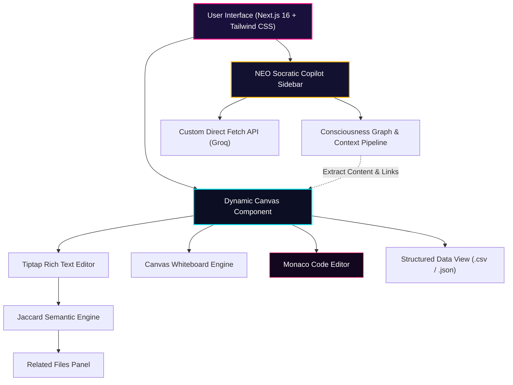

# Project Report: Antigravity (Cortex)

## 1. Project Context & Vision
**Antigravity** (internally known as **Cortex**) is a next-generation, multi-modal cognitive workspace designed to serve as an interactive "consciousness" for user data. Rather than treating files as isolated storage slots, Antigravity establishes dynamic semantic connections across notes, code bases, spreadsheets, and visual whiteboards.

The application is built with a premium **Cyberpunk Neon / Glassmorphic** aesthetic (deep translucency, amber and cyan glows, and fluid animations) to deliver a modern, high-fidelity developer experience.

---

## 2. Core Features & Modalities

### 🖋️ Multi-Modal Dynamic Canvas
The core editor workspace is powered by a custom **Dynamic Canvas** switcher that adapts to the active file's extension:
*   **Rich Text Editor (Tiptap)**: Headless rendering with specialized extensions supporting responsive typography levels, checklists, nested tables, and real-time state synchronization.
*   **Vector Whiteboard**: A low-latency canvas drawing system equipped with a **Pen tool** for persistent sketching and a smart **Laser Pointer tool** for self-fading annotations during screen shares.
*   **Monaco Code Editor (Enhanced)**: Embeds Microsoft's Monaco engine to enable production-grade development. Recent enhancements include:
    *   **MATLAB Syntax Tokenizer**: Integrated a custom lexer/tokenizer to support full MATLAB code syntax coloring, auto-completion, and folding within the workspace.
    *   **Cyberpunk Neon Theme**: A meticulously tuned theme featuring deep-space backgrounds and neon yellow/cyan token highlights.
*   **Structured Data View**: Renders `.csv` and `.json` files into highly interactive, searchable tables and graphs for quick financial or data parsing.

### 🧠 Semantic "Consciousness" Engine
*   **Jaccard Similarity Engine**: A custom client-side similarity pipeline that tokenizes text, removes stopwords, performs keyword analysis, and runs real-time intersection evaluations.
*   **Consciousness Graph**: Renders a force-directed node-link network showing semantic associations between all documents in the workspace.
*   **AI Data Bridge**: Integrates direct structural bridging between disparate file formats (e.g., automatically referencing relevant notes sections when looking at related code or data cells).

---

## 3. Latest Accomplishments & Feature Additions

### 🤖 1. NEO: Context-Aware Socratic AI Copilot
Implemented a custom-engineered brainstorming sidebar named **NEO**:
*   **Socratic Ideation Partner**: Programmed to ask high-leverage, deep-probing questions rather than simple automation, pushing the developer to think deeper without destroying their creative workflow.
*   **Direct API Custom State Pipeline**: Bypasses typical Next.js AI SDK React hook synchronization bugs by utilizing a custom manual state machine and direct fetch stream append protocol, ensuring buttery-smooth streaming even under high context loads.
*   **Graph Context Integration**: Feeds the LLM with immediate file content, active node coordinates, and semantic graph bridges, making the bot highly context-aware in real-time.

### ⚡ 2. Groq Migration (Llama 3.3 70B)
*   Rebuilt the underlying AI Data Bridge to run on **Groq's API utilizing Llama 3.3 70B**.
*   Achieved ultra-fast token output speeds, resulting in instant structured routing, text categorization, and relationship analysis without platform latency.

### 📱 3. Adaptive Mobile Architecture
*   Refactored the application shell into a fully responsive mobile design.
*   **Hamburger Navigation Hub**: Replaced rigid desktop panels with a gorgeous, fluid mobile navigation overlay to toggle between graphs, editors, and sidebars.
*   **SSR Lock Removal**: Resolved Server-Side Rendering min-width locking, letting the UI dynamically scale fluidly to all device widths on client hydration.
*   **Viewport Scaling Optimization**: Configured explicit viewport metadata rules to avoid intrusive automatic mobile zooming during editing.

### 🔧 4. Stability & Async Safety
*   Fixed critical asynchronous state update crashes within the **Tiptap text editor**.
*   Cleaned and standardized error handling across the chat interfaces, eliminating invalid string escape structures in JSON serialization.

### 📂 5. Data Autonomy & "Exit Strategy" Portability Pipeline
Developed a complete, client-side transformation and synchronization engine that respects absolute user data sovereignty, running 100% locally and offline in the browser:
*   **Transformation Pipeline (HTML-to-MD & Strokes-to-SVG)**: Parses multi-page Tiptap documents into pristine standard Markdown (`.md`) and compiles whiteboard drawing pen coordinate matrices into scalable, standard-compliant vector graphics snapshots (`.svg`), accompanied by coordinate JSON files for modular app re-imports.
*   **Obsidian-Native Front-Matter Injection**: Programmatically prefixes all exported notes with a YAML metadata header and appends a "Consciousness Graph Relations" wiki-link block at the footer. This automatically populates Obsidian's local network graph instantly upon folder import.
*   **JSZip Client Bundle Assembly**: Compiles and bundles all transformed files into a virtual directory structure (`/notes`, `/code`, `/whiteboards`, `/data`), completes the in-memory compression, and triggers a fast client download of a workspace ZIP with a root-level relational manifest (`graph.json`).
*   **Direct Local Folder Sync (W3C File System Access API)**: Mounts a chosen local directory directly from the user's hard drive. Edits in Cortex automatically sync recursively to physical local drives in real-time, completely bridging browser sandboxes and local workspace folders without cloud dependencies.

---

## 4. Advanced Technology Stack

| Layer | Technologies & Frameworks |
| :--- | :--- |
| **Frontend Core** | Next.js 16 (App Router), React 19, TypeScript, HTML5 Canvas |
| **Styling & Motion** | TailwindCSS 4, Framer Motion, Lucide Icons, Glassmorphism |
| **Core Editors** | Tiptap Editor (Rich Text), Monaco Editor (Code) |
| **Intelligent Routing** | Groq Llama 3.3 70B, Vercel AI SDK |
| **Graph & Data Visuals** | Recharts, Custom Canvas Force-Directed Engine |
| **Data Persistence** | Supabase, Local Storage Caching, **File System Access API** |
| **Bundling & Exporters** | **JSZip (Client-Side Compression)**, DOMParser conversion, XML SVG compiler |

---

## 5. Summary of Completed Features

*   [x] **Initial Multi-modal Editor Framework**
*   [x] **Tiptap Text Editor with custom table extensions**
*   [x] **Canvas Whiteboard with Pen and Laser Pointer tools**
*   [x] **Interactive Floating Widget Overlays (Checklists, Tables, Images)**
*   [x] **Jaccard Similarity Engine & "Related Files" sidebar**
*   [x] **Consciousness Graph (Force-directed file relationship map)**
*   [x] **Multi-page organization strip for Text & Whiteboard files**
*   [x] **Focus Mode & Dynamic Collapsible Sidebars**
*   [x] **Monaco Code Editor integration**
*   [x] **Custom Monaco Cyberpunk Neon Theme**
*   [x] **Monaco Custom MATLAB Syntax Tokenizer**
*   [x] **NEO: Context-Aware Socratic AI Copilot (Robust manual stream)**
*   [x] **Groq Llama 3.3 70B AI Data Bridge Integration**
*   [x] **Fully Responsive Mobile UI with Hamburger Menu**
*   [x] **Fixed Async Tiptap editor state crashes & chat JSON sanitization**
*   [x] **Data Autonomy: Client-side JSZip compiler and exporter**
*   [x] **HTML-to-Markdown Tiptap conversion engine**
*   [x] **Canvas whiteboard strokes-to-SVG vector compiler**
*   [x] **Obsidian-Native YAML front-matter & Wikilinks injector**
*   [x] **Direct Local Directory Mounting & real-time auto-saving (File System Access API)**

